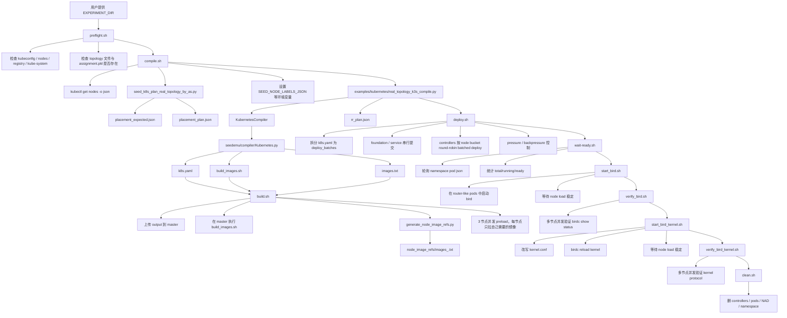
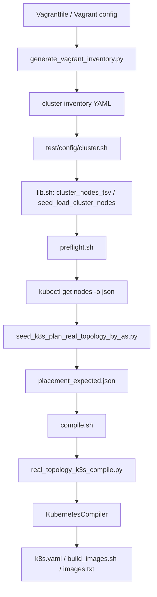

# K8s Standalone Test Flow 架构说明

这份文档解释 `/home/lxl/k8s/lxl/test` 下这套 standalone 流程到底做了什么、各阶段之间如何衔接、compile 产物后续如何被消费，以及如果后面改用 Vagrant 管理虚拟机，应该如何把“节点信息”接入当前 compile / build / deploy 流程。

目标读者是两类人：

- 想直接使用这套流程跑实验的用户
- 想继续扩展这套流程的人，例如把当前 KVM/K3s 节点管理方式替换成 Vagrant

---

## 1. 用户视角的完整流程

用户平时真正需要执行的是：

```bash
EXPERIMENT_DIR=/home/lxl/k8s/lxl/logs/20260507_120000_1078
cd /home/lxl/k8s/lxl/test

./preflight.sh          "${EXPERIMENT_DIR}"
./compile.sh            "${EXPERIMENT_DIR}"
./build.sh              "${EXPERIMENT_DIR}"
./deploy.sh             "${EXPERIMENT_DIR}"
./wait-ready.sh         "${EXPERIMENT_DIR}"
./start_bird.sh         "${EXPERIMENT_DIR}"
./verify_bird.sh        "${EXPERIMENT_DIR}"
./start_bird_kernel.sh  "${EXPERIMENT_DIR}"
./verify_bird_kernel.sh "${EXPERIMENT_DIR}"
```

如果要重新部署同一个 namespace，不能直接再次运行 `deploy.sh`，而是要先：

```bash
./clean.sh "${EXPERIMENT_DIR}"
```

---

## 2. 全流程图



---

## 3. preflight 阶段做了什么

入口脚本：[/home/lxl/k8s/lxl/test/preflight.sh](/home/lxl/k8s/lxl/test/preflight.sh:1)

`preflight.sh` 的作用不是“准备一点环境”，而是做一轮严格的前置验证，防止后面到了 build 或 deploy 才暴露问题。

它当前主要做 5 件事：

### 3.1 建立实验上下文

它通过 [/home/lxl/k8s/lxl/test/lib.sh](/home/lxl/k8s/lxl/test/lib.sh:14) 的 `setup_experiment_context()`：

- 解析 `EXPERIMENT_DIR`
- 推导 `SEED_TOPOLOGY_SIZE`
- 设置 `OUTPUT_DIR=${EXPERIMENT_DIR}/output`
- 设置 `KUBECONFIG`

也就是说，后面所有阶段都不需要用户再手动 export 一堆变量。

### 3.2 检查集群基本状态

它会检查：

- `kubectl get nodes -o wide`
- `kube-system` pod 状态
- registry 从 master 和所有 worker 是否可达

其中 registry 检查不是在本机 curl，而是通过 inventory 里的每个节点 SSH 上去，执行：

- `curl http://${SEED_REGISTRY}/v2/`

这样能提前发现“master registry 虽然活着，但 worker 拉不到”的情况。

### 3.3 检查拓扑输入文件

它验证：

- `real_topology_<SIZE>.txt`
- `assignment.pkl`

这两个输入文件是 compile 的根输入。

### 3.4 检查 namespace 基线

它会拒绝在已有 namespace 上继续 deploy：

- 如果 `seedemu-k3s-real-topo` 已存在，直接失败

这是为了避免重复 deploy 把 cluster 弄成混合状态。

---

## 4. compile 里的 “Generating by-AS placement mapping” 到底是什么

这一步更合理地属于 compile 阶段，而不是 preflight。

原因是它本质上不是“健康检查”，而是“为本次 compile 生成输入”：

- 它依赖当前 Ready 节点集合
- 它会产出本次 compile 专用的硬 placement 结果
- 它直接决定 compile 生成出来的 `k8s.yaml` 长什么样

因此现在的语义应该是：

- `preflight` 只负责检查输入和集群是否适合继续执行
- `compile` 负责根据当前节点状态计算 placement，并把 placement 喂给 compiler

脚本仍然是：

- [/home/lxl/k8s/lxl/seed_k8s_plan_real_topology_by_as.py](/home/lxl/k8s/lxl/seed_k8s_plan_real_topology_by_as.py:1)

它的工作过程是：

1. 读取 `real_topology_<SIZE>.txt`
2. 读取 `assignment.pkl`
3. 读取当前集群 `kubectl get nodes -o json` 的结果
4. 计算每个 AS 会生成多少 Pod
5. 读取每个 Kubernetes node 的 `allocatable.pods`
6. 扣掉一个 `pod reserve` 余量
7. 生成 `ASN -> kubernetes.io/hostname=<node>` 的硬映射

输出结果中最关键的是：

```json
{
  "1439": {
    "kubernetes.io/hostname": "seed-k3s-worker1"
  }
}
```

也就是说，它不是在做“调度建议”，而是在做“硬 placement 计划”。

这也是为什么当前 standalone flow 要求：

- `SEED_SCHEDULING_STRATEGY=by_as_hard` 或 `custom`

因为只有这样 compile 生成的 Pod 才会带硬 `nodeSelector`，后面的 per-node preload 和 round-robin batched deploy 才有意义。

---

## 5. compile 阶段做了什么

入口脚本：[/home/lxl/k8s/lxl/test/compile.sh](/home/lxl/k8s/lxl/test/compile.sh:1)

compile 阶段做三层事情：

### 5.1 生成本次 compile 的 placement 输入

它会先导出当前节点视图：

- `kubectl get nodes -o json > ${EXPERIMENT_DIR}/nodes.ready.json`

然后调用：

- `seed_k8s_plan_real_topology_by_as.py`

生成：

- `placement_expected.json`
- `placement_plan.json`

其中：

- `placement_expected.json` 会被立即读入 `SEED_NODE_LABELS_JSON`
- `placement_plan.json` 作为解释性计划文件保留

### 5.2 收集并固化 compile 输入

它读取：

- `real_topology_<SIZE>.txt`
- `assignment.pkl`
- `placement_expected.json`

并把 `placement_expected.json` 读入环境变量：

- `SEED_NODE_LABELS_JSON`

还会设置：

- `SEED_NAMESPACE`
- `SEED_REGISTRY`
- `SEED_CNI_TYPE`
- `SEED_CNI_MASTER_INTERFACE`
- `SEED_SCHEDULING_STRATEGY`
- `SEED_PLACEMENT_MODE`
- `SEED_OUTPUT_DIR`

### 5.3 调用 Python compile 入口

它真正执行的是：

- [/home/lxl/k8s/examples/kubernetes/real_topology_k3s_compile.py](/home/lxl/k8s/examples/kubernetes/real_topology_k3s_compile.py:1)

### 5.4 real_topology_k3s_compile.py 做了什么

这个 Python 脚本主要负责：

1. 读取真实拓扑数据
2. 在 SeedEmu 内存模型中构建：
   - IXP
   - transit AS
   - stub AS
   - eBGP / iBGP / OSPF
3. 执行 `emu.render()`
4. 从环境变量读取 registry / namespace / CNI / scheduling / node label 配置
5. 实例化 `KubernetesCompiler`
6. 执行：

```python
emu.compile(k8s, output_dir, override=True)
```

这里的关键代码在：

- [/home/lxl/k8s/examples/kubernetes/real_topology_k3s_compile.py](/home/lxl/k8s/examples/kubernetes/real_topology_k3s_compile.py:420)
- [/home/lxl/k8s/examples/kubernetes/real_topology_k3s_compile.py](/home/lxl/k8s/examples/kubernetes/real_topology_k3s_compile.py:436)

也就是说：

- `real_topology_k3s_compile.py` 是 compile 入口
- `KubernetesCompiler` 是真正的 K8s 产物生成器

---

## 6. KubernetesCompiler 做了什么

入口类：

- [/home/lxl/k8s/seedemu/compiler/Kubernetes.py](/home/lxl/k8s/seedemu/compiler/Kubernetes.py:27)

当前这套流程里，它的职责是把已经构建好的 SeedEmu 网络，编译成：

- Kubernetes manifest
- 镜像 build 上下文
- 镜像构建脚本
- image 列表

关键点有三类。

### 6.1 生成 k8s.yaml

它会给每个 SeedEmu 节点生成相应的 Kubernetes workload 定义。

最重要的是，它会把调度语义写进 Pod spec：

- `nodeSelector`
- `affinity`
- `topologySpreadConstraints`

对于当前 standalone flow 来说，最关键的是：

- `BY_AS_HARD` 会把 `SEED_NODE_LABELS_JSON` 映射写入 `nodeSelector`

这样 `k8s.yaml` 中每个 workload 会被硬绑定到某个 node。

### 6.2 生成 build_images.sh

`KubernetesCompiler` 会在 compile 目录里自动写出：

- `build_images.sh`

这个脚本描述的是：

- 需要 build 哪些镜像
- 这些镜像从哪些 Docker build context 构建
- 是否 push 到 registry

它是 compile 产物，不是用户手工维护的主脚本。

### 6.3 生成 images.txt

它还会生成：

- `images.txt`

这是一份最终镜像引用列表，后面的 build / preload 可以直接消费。

---

## 7. compile 产物有哪些，以及后面分别被谁消费

当前 compile 阶段最关键的产物如下。

### 7.1 k8s.yaml

作用：

- 完整 Kubernetes manifest

后续消费者：

- `build.sh`
  - 先验证里面是否存在硬 `nodeSelector`
  - 再调用 `generate_node_image_refs.py` 从中提取“每个节点需要哪些镜像”
- `deploy.sh`
  - 把它拆分成 `00-crds` / `01-foundation` / `02-services` / `03-controllers`

### 7.2 build_images.sh

作用：

- compile 自动生成的镜像构建计划

后续消费者：

- `build.sh`
  - 上传到 master
  - 在 master 上执行它完成真实镜像构建

### 7.3 images.txt

作用：

- compile 产出的最终镜像引用集合

后续消费者：

- `build.sh`
  - 如果存在，就复制为 `${EXPERIMENT_DIR}/image_refs.txt`
  - 如果不存在，则退回从 `build_images.sh` 里解析

### 7.4 rr_plan.json

作用：

- 记录 transit AS 的 route reflector 规划

后续消费者：

- 当前主要是解释性产物，便于调试和论文/实验分析

### 7.5 placement_expected.json

作用：

- ASN -> nodeSelector 映射

后续消费者：

- `compile.sh`
  - 作为 `SEED_NODE_LABELS_JSON` 传入 `real_topology_k3s_compile.py`

### 7.6 placement_plan.json

作用：

- 记录节点承载分配计划

后续消费者：

- 当前主要是可解释性与诊断用途

---

## 8. generate_node_image_refs.py 在流程里的位置

脚本：

- [/home/lxl/k8s/lxl/test/generate_node_image_refs.py](/home/lxl/k8s/lxl/test/generate_node_image_refs.py:1)

它不参与 compile 本身，而是在 build 阶段消费 compile 结果。

它做的事情是：

1. 读取 `output/k8s.yaml`
2. 遍历每个 workload 的 Pod spec
3. 读取：
   - `spec.nodeSelector["kubernetes.io/hostname"]`
   - `containers[*].image`
   - `initContainers[*].image`
4. 生成：
   - `images_<node>.txt`
   - `summary.json`

因此它的角色是：

- compile 之后的“manifest -> per-node image preload plan”转换器

如果 `k8s.yaml` 里没有硬 `nodeSelector`，它就无法得出“某个 node 需要拉哪些镜像”，于是只会得到一堆空列表。这也是之前出现：

- `[preload] skip: no images assigned to ...`

的根本原因。

---

## 9. build 阶段做了什么

入口脚本：

- [/home/lxl/k8s/lxl/test/build.sh](/home/lxl/k8s/lxl/test/build.sh:1)

它不是简单执行 `docker build`，而是一个 orchestration 脚本。

### 9.1 它先验证 compile 产物是否可用

它要求：

- `output/build_images.sh` 存在
- `output/k8s.yaml` 存在

然后先调用 `generate_node_image_refs.py` 做一次验证，如果发现：

- `missing_selector_count > 0`

就直接失败，不会继续远端 build。

### 9.2 它修复 / 验证 master registry

如果 master 上 registry 不通，它会调用：

- `test/ensure_master_registry.sh`

确保 build 后 push 和后续 preload 有地方可拉。

### 9.3 它执行真实远端构建

它会把整个 `output/` 打包上传到 master，然后在 master 上运行 compile 生成的：

- `build_images.sh`

因此：

- `build.sh` 是外层 orchestration
- `build_images.sh` 是 compile 产物里的镜像构建计划

### 9.4 它生成 per-node preload 计划并执行 preload

build 成功后，它会再调用：

- `generate_node_image_refs.py`

把结果保存到：

- `${EXPERIMENT_DIR}/node_image_refs/images_<node>.txt`

然后按当前要求执行：

- 最多 3 个 node 并发
- 每个 node 只拉自己需要的镜像

---

## 10. deploy 阶段做了什么

入口脚本：

- [/home/lxl/k8s/lxl/test/deploy.sh](/home/lxl/k8s/lxl/test/deploy.sh:1)

它消费的核心 compile 产物是：

- `output/k8s.yaml`

它会：

1. 检查 namespace 不存在
2. 检查 stale residual resources 不存在
3. 把 `k8s.yaml` 拆成分组目录
4. 串行提交：
   - `00-crds`
   - `01-foundation`
   - `02-services`
5. 对 controllers 执行：
   - node bucket round-robin
   - batched deploy
   - pressure/backpressure 控制
6. 失败时抓取 failure artifacts

这里 compile 阶段生成的 `nodeSelector` 非常关键，因为 deploy 的 node bucket 逻辑正是依赖它来按节点轮转分发 controller。

---

## 11. wait-ready / start_bird / verify_bird / start_bird_kernel / verify_bird_kernel / clean 分别做什么

### 11.1 wait-ready

入口：

- [/home/lxl/k8s/lxl/test/wait-ready.sh](/home/lxl/k8s/lxl/test/wait-ready.sh:1)

它周期性抓 namespace pod json，统计：

- total
- running
- ready
- seedemu 子集
- router-like 子集

直到全部 Ready 才返回成功。

### 11.2 start_bird

入口：

- [/home/lxl/k8s/lxl/test/start_bird.sh](/home/lxl/k8s/lxl/test/start_bird.sh:1)

它会在所有 router-like pod 中启动 `bird`，并最终通过：
- 节点间并发、节点内串行
- 等待 node load 稳定

它不再承担最终验证职责。

### 11.3 verify_bird

入口：

- [/home/lxl/k8s/lxl/test/verify_bird.sh](/home/lxl/k8s/lxl/test/verify_bird.sh:1)

它负责独立验证：

- `pgrep -x bird`
- `birdc show status`

验证方式是：

- 节点间并发
- 节点内串行

这样不会把所有 `kubectl exec` 一次性压到同一台节点上。

### 11.4 start_bird_kernel

入口：

- [/home/lxl/k8s/lxl/test/start_bird_kernel.sh](/home/lxl/k8s/lxl/test/start_bird_kernel.sh:1)

它会在 router-like pod 里改写：

- `/etc/bird/conf/kernel.conf`

然后执行 `birdc configure` / `birdc reload kernel`，并等待 node load 稳定。

### 11.5 verify_bird_kernel

入口：

- [/home/lxl/k8s/lxl/test/verify_bird_kernel.sh](/home/lxl/k8s/lxl/test/verify_bird_kernel.sh:1)

它负责独立验证 kernel protocol 是否已经 up，同样采用：

- 节点间并发
- 节点内串行

### 11.6 clean

入口：

- [/home/lxl/k8s/lxl/test/clean.sh](/home/lxl/k8s/lxl/test/clean.sh:1)

它负责：

- 先删 namespaced resources
- 再删 namespace
- 如果 namespace finalizer 卡住，则做安全 finalize

它的目标是把下一次实验的 namespace 基线恢复干净。

---

## 12. 为什么说当前流程已经具备“节点抽象层”

当前流程虽然是为 K3s + KVM 写的，但它实际上已经把“节点信息来源”抽象出去了。

关键在两层：

### 12.1 test/config/cluster.sh

这里定义了：

- `SEED_CLUSTER_INVENTORY_PATH`
- `SEED_K3S_USER`
- `SEED_K3S_SSH_KEY`
- `SEED_REGISTRY`

也就是说，节点信息本来就不是硬编码在 compile 里，而是从 config 读入。

### 12.2 lib.sh 的 cluster_nodes_tsv / seed_load_cluster_nodes

[/home/lxl/k8s/lxl/test/lib.sh](/home/lxl/k8s/lxl/test/lib.sh:83) 会读取 inventory YAML，导出：

- 节点名
- 管理 IP
- 角色

随后：

- preflight 用它来做 registry reachability 检查
- build 用它来做 per-node preload
- repair / monitor 也用它来 SSH 到具体节点

因此，当前系统的真实耦合点不是“必须是 virsh/KVM”，而是：

- 能否提供一份等价的 cluster inventory

---

## 13. 如果以后想用 Vagrant 管理虚拟机，应该怎么做

你的问题可以表述为：

> 如果告诉系统“现在有 n 台虚拟机”，并提供一个 Vagrant 的 config 文件，能不能让 compile / build / deploy 自动适配？

答案是：可以，而且不应该先改 `KubernetesCompiler`，而应该先改“节点信息来源层”。

### 13.1 不应该改的部分

以下几层 ideally 不需要改：

- `seed_k8s_plan_real_topology_by_as.py`
- `real_topology_k3s_compile.py`
- `KubernetesCompiler`

因为它们只关心两件事：

1. 当前 Ready 节点有哪些
2. `SEED_NODE_LABELS_JSON` 是什么

换句话说，compile 不关心节点是：

- virsh 管的
- Vagrant 管的
- Terraform 起的

它只关心“节点名”和“可用容量”。

### 13.2 应该新增的一层：Vagrant inventory 生成器

更合理的做法是新增一个脚本，例如：

- `test/generate_vagrant_inventory.py`

输入：

- `Vagrantfile`
- 或者一个 Vagrant 导出的 YAML/JSON 节点配置

输出：

- 当前格式兼容的 inventory YAML

例如生成：

```yaml
nodes:
  - name: seed-k3s-master
    management_ip: 192.168.56.10
    role: master
  - name: seed-k3s-worker1
    management_ip: 192.168.56.11
    role: worker
  - name: seed-k3s-worker2
    management_ip: 192.168.56.12
    role: worker
```

只要生成的格式兼容 `cluster_nodes_tsv()` 的读取方式，后面的：

- preflight
- build
- deploy
- repair

都可以继续使用。

### 13.3 compile 如何“自适应”不同节点数

真正让 compile 自适应的关键不是 Vagrant 本身，而是这两步：

1. `kubectl get nodes -o json`
2. `seed_k8s_plan_real_topology_by_as.py`

因为 placement planner 会根据当前节点列表和 `allocatable.pods` 自动算：

- 有多少可用节点
- 每个节点剩余多少容量
- 每个 AS 应该分给哪个节点

因此，当 Vagrant 带来的集群变化体现到：

- `kubectl get nodes`

之后，compile 的 placement 其实天然就会自适应。

### 13.4 最小改造方案

如果你要把当前工程迁移到 “Vagrant 管理 VM” 的模式，最小改动建议是：

1. 保持 `test/` 主流程不变
2. 新增一个 Vagrant inventory 生成器
3. 让 `SEED_CLUSTER_INVENTORY_PATH` 指向这个生成出来的 inventory
4. 确保：
   - 节点名和 Kubernetes node name 一致
   - inventory 里的 IP 可 SSH
   - K3s 注册到 Kubernetes 的 hostname 与 inventory 一致

这样后面的 preflight / compile / build / deploy 都可以直接复用。

### 13.5 如果想做得更完整

可以进一步做一个统一入口，例如：

- `test/select_cluster_backend.sh`

支持：

- `backend=kvm`
- `backend=vagrant`

由它根据 backend 自动生成：

- `SEED_CLUSTER_INVENTORY_PATH`
- `SEED_K3S_MASTER_IP`
- `SEED_K3S_USER`
- `SEED_K3S_SSH_KEY`

这样用户只需要切换 backend，而不需要手工改多个配置项。

---

## 14. 推荐的 Vagrant 适配架构

推荐思路如下：



这个架构的核心思想是：

- 把 Vagrant 的差异收敛在 inventory 生成层
- 不要把 VM 管理方式渗透进 compile / compiler 主体

---

## 15. 最后一句话总结

这套 standalone 流程的主线其实很清晰：

- `preflight` 负责验证集群基线，并根据当前 Ready 节点生成硬 placement
- `compile` 负责把真实拓扑和 placement 一起交给 `real_topology_k3s_compile.py`
- `real_topology_k3s_compile.py` 再把模型交给 `KubernetesCompiler`
- `KubernetesCompiler` 负责生成 `k8s.yaml`、`build_images.sh`、`images.txt`
- `build` 消费 compile 产物完成真实远端 build 和 per-node preload
- `deploy` 消费 `k8s.yaml` 完成 batched deploy
- `wait-ready` / `start_bird` / `start_bird_kernel` 完成运行态收敛
- `clean` 负责把 namespace 恢复到可再次实验的状态

如果以后切到 Vagrant，最合理的改造点不是 compiler，而是：

- 先让 Vagrant 节点信息变成兼容的 inventory
- 再复用当前已有的 placement planner 和 compile / build / deploy 主流程
